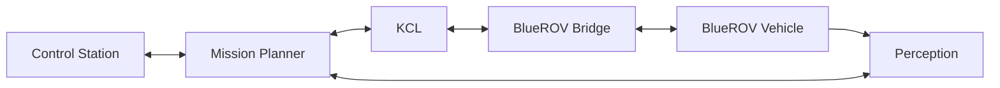
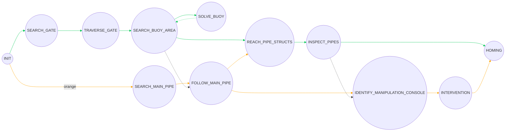
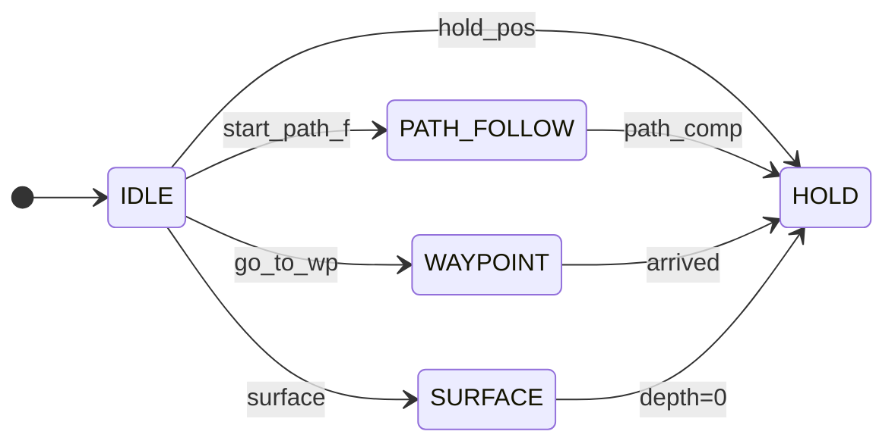
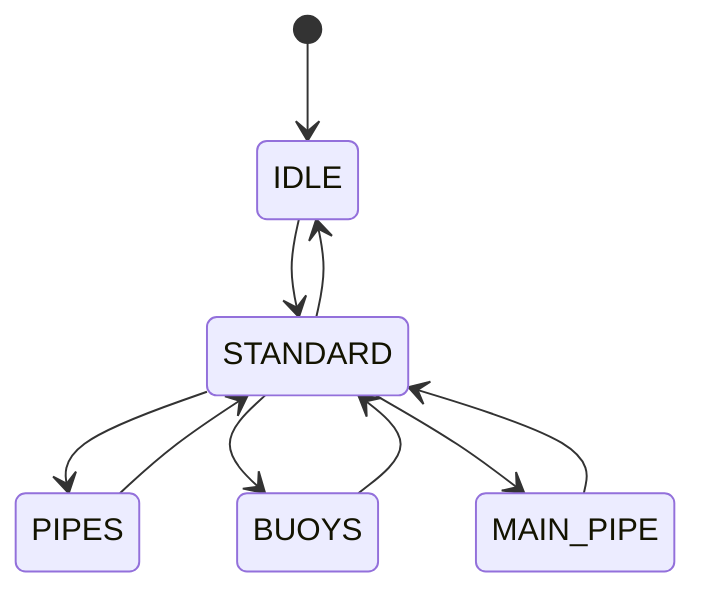

# System Architecture

This document provides a full view of the architecture and associated finite state machines (FSMs) for the underwater robotics platform.

---

## 📦 High-Level Architecture

---

## 🔁 Mission Planner FSM

---

## 🧭 KCL FSM

---

## 🔍 Perception FSM

