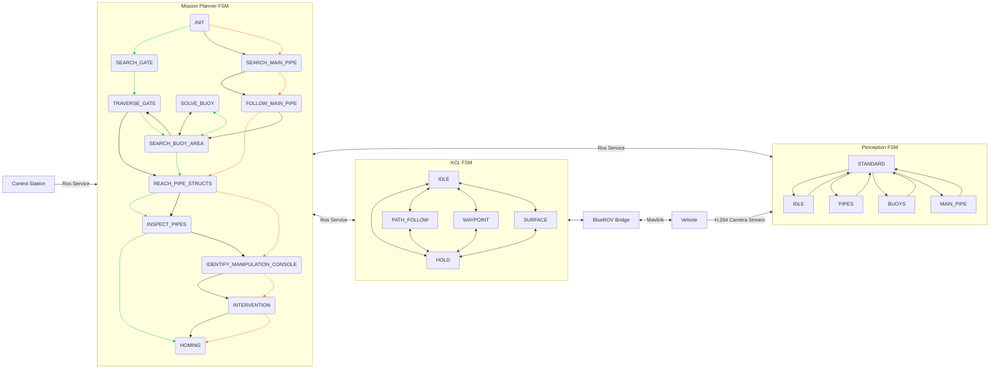

# System Architecture

This document provides a full view of the architecture and associated finite state machines (FSMs) for the underwater robotics platform.

---

---

### Notes
Legend for arrows color in Mission planner FSM:
- green = TBM1
- orange = TBM2
- black = TBM3